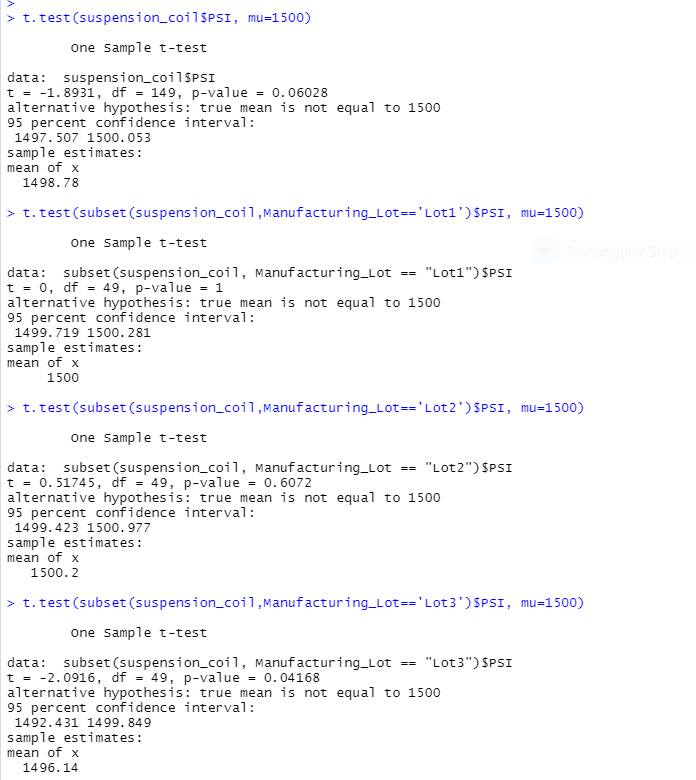

# MechaCar_Statistical_Analysis

## Project overview
To perform statistical analysis using the production data for insights to help the manufacturing team with production troubles. 

## Resources
* R
* library: dplyr
* RStudio
* Datasets: MechaCar_mpg.csv, Suspension_Coil.csv

## Linear Regression to Predict MPG
Which variables/coefficients provided a non-random amount of variance to the mpg values in the dataset?
The linear regression model shows that the 

* vehicle_weight 0.0776 p-value
* spoiler_angle 0.3069 p-value
* AWD 0.1852 p-value
variables show non random effect on the mpg values. Higher p-value shows no-random amount of variance. Compare withe the Vehicle Length with p-value of 2.60 x 10-12(= 0.00000000000206) and the variable Ground Clearance with p-value of 5.21 x 10-8 (= 0.0000000521). Such small p-values show random amount of variance.

* Is the slope of the linear model considered to be zero? Why or why not?
It is not considered to be at zero, because the p-value of this linear reqression is 5.35 x10 -11(= 0.0000000000535), which is much smaller then the assumed statistical significance level of P <0.05.

* Does this linear model predict mpg of MechaCar prototypes effectively? Why or why not?
With the Multiple R-squared at 0.7149 (71%) it shows that this model would not predict mpg of MechaCar prototypes effectively.  

 
## Summary Statistics on Suspension Coils
The design specifications for the MechaCar suspension coils dictate that the variance of the suspension coils must not exceed 100 pounds per square inch. Does the current manufacturing data meet this design specification for all manufacturing lots in total and each lot individually? Why or why not?
* As seen in the lot summary below, Lot 1 and Lot 2 have the same Median and variance is closer to zero so they are within design specifications. Lot 3 has higher variance, so it does not meet the design specifications. 

## T-Tests on Suspension Coils
* Summarize your interpretation and findings for the t-test results
The population mean given is 1500 pounds per inch.  The p-value for the (suspension coil's pounds-per-inch) sample dataset is (0.06028) which is above the 0.05 significance level, there is no sufficient evidence to reject the null hypothesis.

## Study Design: MechaCar vs Competition
Some of the features people might be interested in when buying a new car is the cost, fuel efficiency, trunk space, if the heater works well in the winter.  To use the example of trunk size for the hypothesis, if somebody is interested in hiking a null hypothesis would be, do other cars have a bigger trunk space? The alternative hypothesis would be does the MechaCar have bigger trunk space.   Anova test would compare multiple trunk sizes from different car manufucturers.  

